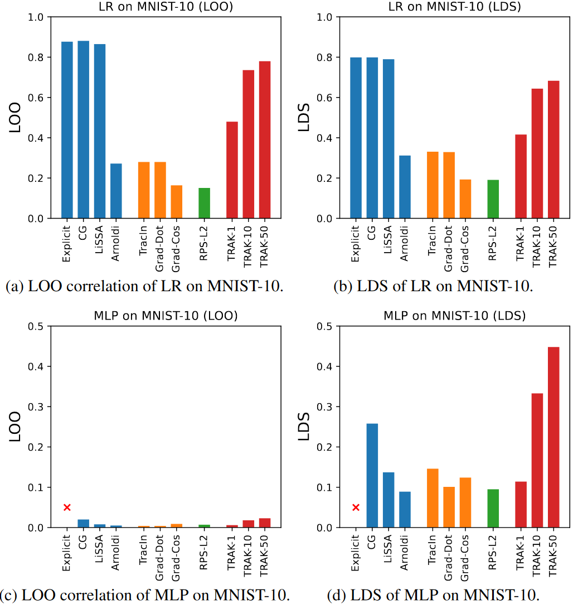
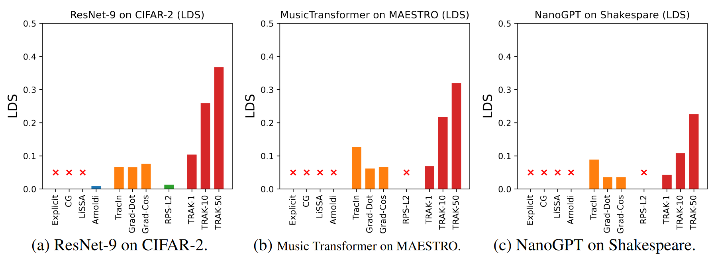
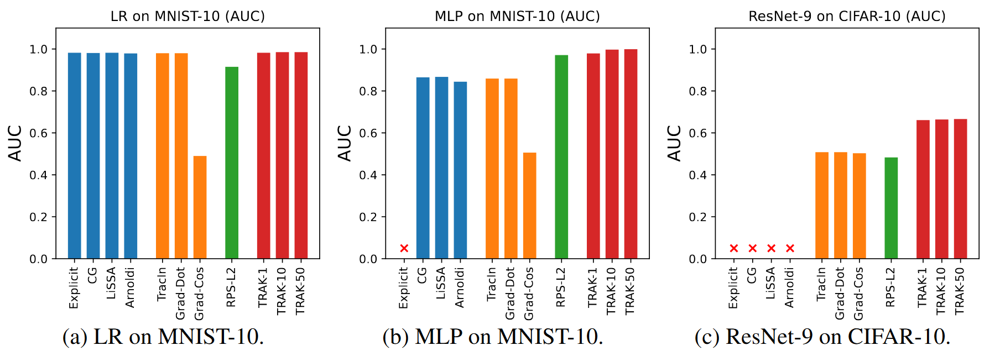

<div align="center">

</div>

# A Library for Efficient Data Attribution
[](https://trais-lab.github.io/dattri/)
[](https://pypi.org/project/dattri/)
[](https://arxiv.org/pdf/2410.04555)

[**Quick Start**](#quick-start)
| [**Algorithms**](#supported-algorithms)
| [**Metrics**](#supported-metrics)
| [**Benchmark Settings**](#supported-benchmark-settings)
| [**Benchmark Results**](#benchmark-results)

## What is *dattri* ?

*dattri* is a PyTorch library for **developing, benchmarking, and deploying efficient data attribution algorithms**. You may use *dattri* to

- Deploy existing data attribution methods to PyTorch models
  - e.g., Influence Function, TracIn, RPS, TRAK, ...
- Develop new data attribution methods with efficient implementation of low-level utility functions
  - e.g., Hessian (HVP/IHVP), Fisher Information Matrix (IFVP), random projection, dropout ensembling, ...
- Benchmark data attribution methods with standard benchmark settings
  - e.g., MNIST-10+LR/MLP, CIFAR-10/2+ResNet-9, MAESTRO + Music Transformer, Shakespeare + nanoGPT, ...

### Contents

- [A Library for Efficient Data Attribution](#a-library-for-efficient-data-attribution)
  - [What is *dattri* ?](#what-is-dattri-)
    - [Contents](#contents)
  - [Quick Start](#quick-start)
    - [Installation](#installation)
      - [Recommended enviroment setup](#recommended-enviroment-setup)
    - [Apply data attribution methods on PyTorch models](#apply-data-attribution-methods-on-pytorch-models)
    - [Use low-level utility functions to develop new data attribution methods](#use-low-level-utility-functions-to-develop-new-data-attribution-methods)
      - [HVP/IHVP](#hvpihvp)
      - [Random Projection](#random-projection)
      - [Dropout Ensemble](#dropout-ensemble)
  - [Supported Algorithms](#supported-algorithms)
  - [Supported Metrics](#supported-metrics)
  - [Supported Benchmark Settings](#supported-benchmark-settings)
  - [Benchmark Results](#benchmark-results)
    - [MNIST+LR/MLP](#mnistlrmlp)
    - [LDS performance on larger models](#lds-performance-on-larger-models)
    - [AUC performance](#auc-performance)
  - [Development Plan](#development-plan)
  - [Citation](#citation)

## Quick Start

### Installation

```bash
pip install dattri
```

If you want to use `fast_jl` to accelerate the random projection, you may install the version with `fast_jl` by

```bash
pip install dattri[fast_jl]
```

> [!NOTE]
> It's highly recommended to use a device support CUDA to run *dattri*, especially for large models or datasets.

> [!NOTE]
> It's required to have CUDA if you want to install and use the fast_jl version `dattri[fast_jl]` to accelerate the random projection. The projection is mainly used in `TRAKAttributor`. Please use `pip<23` and `torch<2.3` due to some known issue of `fast_jl` library.

#### Recommended enviroment setup
It's **not** required to follow the exact same steps in this section. But this is a verified environment setup flow that may help users to avoid most of the issues during the installation.

```bash
conda create -n dattri python=3.10
conda activate dattri

conda install -c "nvidia/label/cuda-11.8.0" cuda-toolkit
pip3 install torch==2.1.0 --index-url https://download.pytorch.org/whl/cu118

pip install dattri[fast_jl]
```

### Apply data attribution methods on PyTorch models

One can apply different data attribution methods on PyTorch Models. One only needs to define:
1. loss function used for model training (will be used as target function to be attributed if no other target function provided).
2. trained model checkpoints (one or more).
3. the data loaders for training samples and test samples (e.g., `train_loader`, `test_loader`).
4. (optional) target function to be attributed if it's not the same as loss function.

The following is an example to use `IFAttributorCG` and `AttributionTask` to apply data attribution to a PyTorch model.

**More examples can be found [here](./examples/).**

```python
import torch
from torch import nn

from dattri.algorithm import IFAttributorCG
from dattri.task import AttributionTask
from dattri.benchmark.datasets.mnist import train_mnist_lr, create_mnist_dataset
from dattri.benchmark.utils import SubsetSampler


dataset_train, dataset_test = create_mnist_dataset("./data")

train_loader = torch.utils.data.DataLoader(
    dataset_train,
    batch_size=1000,
    sampler=SubsetSampler(range(1000)),
)
test_loader = torch.utils.data.DataLoader(
    dataset_test,
    batch_size=100,
    sampler=SubsetSampler(range(100)),
)

model = train_mnist_lr(train_loader)

def f(params, data_target_pair):
    x, y = data_target_pair
    loss = nn.CrossEntropyLoss()
    yhat = torch.func.functional_call(model, params, x)
    return loss(yhat, y)

task = AttributionTask(loss_func=f,
                       model=model,
                       checkpoints=model.state_dict())

attributor = IFAttributorCG(
    task=task,
    max_iter=10,
    regularization=1e-2
)

attributor.cache(train_loader)
with torch.no_grad():
    score = attributor.attribute(train_loader, test_loader)
```


### Use low-level utility functions to develop new data attribution methods

#### HVP/IHVP
Hessian-vector product (HVP), inverse-Hessian-vector product
(IHVP) are widely used in data attribution methods. `dattri` provides efficient implementation to these operators by `torch.func`. This example shows how to use the CG implementation of the IHVP implementation.

```python
import torch
from dattri.func.hessian import ihvp_cg, ihvp_at_x_cg

def f(x, param):
    return torch.sin(x / param).sum()

x = torch.randn(2)
param = torch.randn(1)
v = torch.randn(5, 2)

# ihvp_cg method
ihvp_func = ihvp_cg(f, argnums=0, max_iter=2) # argnums=0 indicates that the param of (x, param) to be passed to ihvp_func is the model parameter
ihvp_result_1 = ihvp_func((x, param), v) # both (x, param) and v as the inputs
# ihvp_at_x_cg method: (x, param) is cached
ihvp_at_x_func = ihvp_at_x_cg(f, x, param, argnums=0, max_iter=2)
ihvp_result_2 = ihvp_at_x_func(v) # only v as the input
# the above two will give the same result
assert torch.allclose(ihvp_result_1, ihvp_result_2)
```

#### Random Projection
It has been shown that long vectors will retain most of their relative information when projected down to a smaller feature dimension. To reduce the computational cost, random projection is widely used in data attribution methods. Following is an example to use `random_project`. The implementation leaverges [`fast_jl`](https://pypi.org/project/fast-jl/).

```python
from dattri.func.random_projection import random_project

# initialize the projector based on users' needs
project_func = random_project(tensor, tensor.size(0), proj_dim=512)

# obtain projected tensors
projected_tensor = project_func(torch.full_like(tensor))
```

Normally speaking, `tensor` is probably the gradient of loss/target function and has a large dimension (i.e., the number of parameters).

#### Dropout Ensemble
Recent studies found that ensemble methods can significantly improve the performance of data attribution, [DROPOUT ENSEMBLE](https://arxiv.org/pdf/2405.17293) is one of these ensemble methods. One may prepare their model with

```python
from dattri.model_util.dropout import activate_dropout

# initialize a torch.nn.Module model
model = MLP()

# (option 1) activate all dropout layers
model = activate_dropout(model, dropout_prob=0.2)

# (option 2) activate specific dropout layers
# here "dropout1" and "dropout2" are the names of dropout layers within the model
model = activate_dropout(model, ["dropout1", "dropout2"], dropout_prob=0.2)
```

## Supported Algorithms
We have implemented most of the state-of-the-art methods. The categories and reference paper of the algorithms are listed in the following table.
| Family |               Algorithms              |
|:------:|:-------------------------------------:|
|   [IF](https://arxiv.org/abs/1703.04730)   | [Explicit](https://arxiv.org/abs/1703.04730) |
|        |       [CG](https://www.cs.toronto.edu/~jmartens/docs/Deep_HessianFree.pdf)      |
|        |    [LiSSA](https://arxiv.org/abs/1602.03943)    |
|        |  [Arnoldi](https://arxiv.org/abs/2112.03052)  |
| | [DataInf](https://arxiv.org/abs/2310.00902)|
| | [EK-FAC](https://arxiv.org/abs/2308.03296) |
| | [RelatIF](https://arxiv.org/pdf/2003.11630) |
| | [LoGra](https://arxiv.org/pdf/2405.13954) |
| [TracIn](https://arxiv.org/abs/2002.08484) | [TracInCP](https://arxiv.org/abs/2002.08484) |
|        |   [Grad-Dot](https://arxiv.org/abs/2102.05262)  |
|        |   [Grad-Cos](https://arxiv.org/abs/2102.05262)  |
|   [RPS](https://arxiv.org/abs/1811.09720)  |   [RPS-L2](https://arxiv.org/abs/1811.09720)   |
|  [TRAK](https://arxiv.org/abs/2303.14186)  |       [TRAK](https://arxiv.org/abs/2303.14186)       |
|  [Shapley Value](https://arxiv.org/abs/1904.02868)  |       [KNN-Shapley](https://dl.acm.org/doi/10.14778/3342263.3342637)       |

## Supported Metrics
- Leave-one-out (LOO) correlation
- Linear datamodeling score (LDS)
- Area under the ROC curve (AUC) for noisy label detection
- Brittleness test for checking flipped label

## Supported Benchmark Settings
|   Dataset   |       Model       |         Task         | Sample Size (train, test) | Parameter Size |   Metric   |          Data Source         |
|:-----------:|:-----------------:|:--------------------:|:------------------------:|:--------------:|:-----------:|:----------------------------:|
|   MNIST-10  |         LR        | Image Classification |        (5000,500)        |      7840      | LOO/LDS/AUC |      [link](http://yann.lecun.com/exdb/mnist/)     |
|   MNIST-10  |        MLP        | Image Classification |        (5000,500)        |      0.11M     | LOO/LDS/AUC |      [link](http://yann.lecun.com/exdb/mnist/)     |
|   CIFAR-2   |      ResNet-9     | Image Classification |        (5000,500)        |      4.83M     |     LDS     | [link](https://www.cs.toronto.edu/~kriz/cifar.html) |
|   CIFAR-10  |      ResNet-9     | Image Classification |        (5000,500)        |      4.83M     |     AUC     | [link](https://www.cs.toronto.edu/~kriz/cifar.html) |
|   MAESTRO   | Music Transformer |   Music Generation   |        (5000,178)        |      13.3M     |     LDS     |  [link](https://magenta.tensorflow.org/datasets/maestro) |
| Shakespeare |      nanoGPT      |    Text Generation   |        (3921,435)        |      10.7M     |     LDS     |     [link](https://github.com/karpathy/nanoGPT)    |

## Benchmark Results
### MNIST+LR/MLP


### LDS performance on larger models


### AUC performance


## Development Plan
- More (larger) benchmark settings to come
  - Wikitext + GPT2
- More algorithms and low-level utility functions to come
  - KNN filter
  - TF-IDF filter
  - [Data Value Embedding](https://arxiv.org/pdf/2412.09538)
  - [GraSS](https://arxiv.org/pdf/2505.18976)
- Better documentation
  - Quick start colab notebooks

## Citation

```bibtex
@inproceedings{NEURIPS2024_f7326833,
    author    = {Deng, Junwei and Li, Ting-Wei and Zhang, Shiyuan and Liu, Shixuan and Pan, Yijun and Huang, Hao and Wang, Xinhe and Hu, Pingbang and Zhang, Xingjian and Ma, Jiaqi},
    title     = {dattri: A Library for Efficient Data Attribution},
    booktitle = {Advances in Neural Information Processing Systems},
    editor    = {A. Globerson and L. Mackey and D. Belgrave and A. Fan and U. Paquet and J. Tomczak and C. Zhang},
    pages     = {136763--136781},
    publisher = {Curran Associates, Inc.},
    url       = {https://proceedings.neurips.cc/paper_files/paper/2024/file/f732683302d91e47610b2416b4977a66-Paper-Datasets_and_Benchmarks_Track.pdf},
    volume    = {37},
    year      = {2024}
}
```
